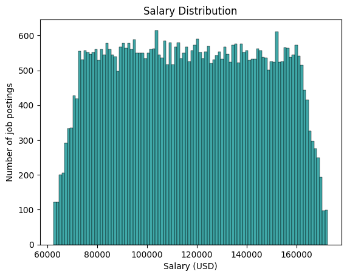
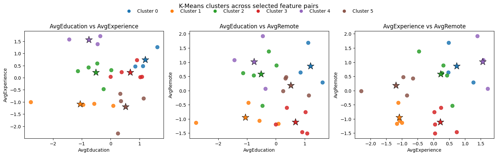
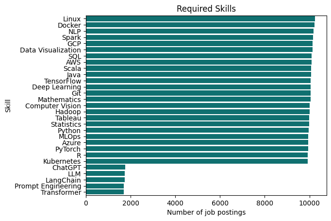
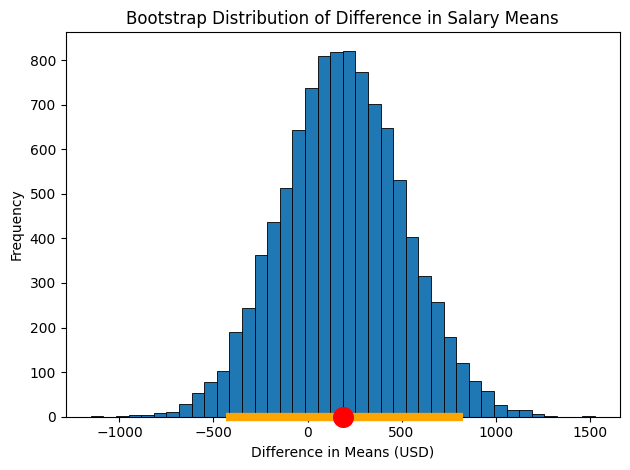

# 📊 AI Job Posting Trends Analysis (2019-2023)

> A comprehensive data science case study analyzing 50,000 AI job postings to uncover market trends, salary drivers, and skill clustering patterns.

## 🎯 Project Highlights

| Metric | Value |
|--------|-------|
| **Dataset Size** | 50,000 AI job postings |
| **Time Period** | 2019-2023 |
| **Analysis Methods** | Statistical Inference + Machine Learning |
| **Key Finding** | 6 distinct skill clusters identified |

## 💡 Business Questions Answered

- 💰 **What drives AI salaries?** Salary ranges from $60K-$170K (median: ~$115K)
- 📈 **What skills are most in-demand?** Mapped across 6 distinct job clusters
- 🎓 **What qualifications matter?** Bachelor's or Master's degree standard
- 🌍 **Where are opportunities?** Healthcare, Telecommunications, Manufacturing lead

## 📈 Visualizations

### Salary Distribution Across AI Roles

*Distribution of AI job salaries showing concentration in the $60K-$170K range*

### K-Means Clustering Results (k=6)

*Six distinct job clusters based on education, experience, and remote work requirements*

### Top In-Demand Skills


**Key Insight:** The significant drop-off for ChatGPT, LLM, and LangChain reflects their recent emergence (2022-2023). These technologies were barely mentioned in job postings during the 2019-2022 period, but are likely to see rapid growth in 2024+. This highlights how quickly the AI job market evolves and adapts to new tools and frameworks.

### Bootstrap Resampling Results

*Confidence intervals from 10,000 bootstrap iterations testing salary impact of Linux skill*

## 🔧 Technical Approach

### Phase 1: Data Preprocessing & Feature Engineering
- **Skill Tokenization**: Raw text → cleaned Python lists
- **Encoding Strategy**: One-Hot Encoding (skills), Ordinal Encoding (education, experience, remote work)
- **Output**: 50K+ records ready for analysis

### Phase 2: Statistical Inference (Hypothesis Testing)
- **Method**: Bootstrap Resampling (10,000 iterations)
- **Question**: Does Linux proficiency significantly impact salary?
- **Result**: 95% CI: [-445.12, 813.99] → No significant impact detected

### Phase 3: Machine Learning (K-Means Clustering)
- **Objective**: Group AI jobs by requirements
- **Optimization**: Elbow Method → k=6 clusters
- **Insight**: Strong positive correlation between education level and required experience

## 📊 Key Findings

✅ **Market Demand**: Relatively uniform across industries (slight concentration in Healthcare, Telecommunications, Manufacturing)  
✅ **Salary Landscape**: Median ~$115K, most roles $60K-$170K  
✅ **Education Requirements**: ~90% require Bachelor's/Master's degree  
✅ **Skill Clustering**: Education and experience requirements move together  

## 🛠️ Tech Stack

| Category | Tools |
|----------|-------|
| **Language** | Python |
| **Data Processing** | Pandas |
| **Visualization** | Matplotlib, Seaborn |
| **Machine Learning** | Scikit-learn |
| **Environment** | Google Colab, GitHub |

## ⚠️ Limitations & Next Steps

- 🔍 **Selection Bias**: Unknown dataset source may limit generalizability
- 📉 **Variable Ranges**: Narrow distributions made strong correlations difficult to detect
- 🎯 **Future Work**: Incorporate more recent data (2024+), test additional clustering methods

## 📁 Repository Structure

```
├── images/                  # Visualization outputs
├── data/                    # Raw and processed datasets
├── notebooks/               # Jupyter/Colab analysis notebooks
└── README.md               # This file
```

## 🚀 Getting Started

```bash
# Clone the repository
git clone https://github.com/sofafaerman/AI-Job-Posting-Trends-Analysis.git

# Install dependencies
pip install pandas matplotlib seaborn scikit-learn

# Open notebooks in Google Colab or Jupyter
jupyter notebook
```

## 📚 Learn More

Check out the Jupyter notebooks in the `notebooks/` folder for detailed analysis and code walkthroughs.

## 👤 Author

**Sofia Faerman**  
[GitHub](https://github.com/sofafaerman)

---

**Topics**: `data-science` `machine-learning` `statistics` `clustering` `python`
